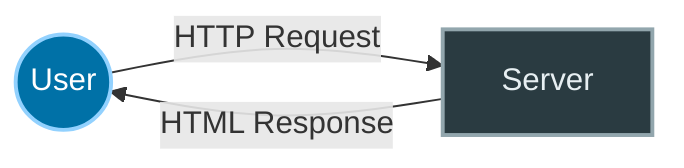
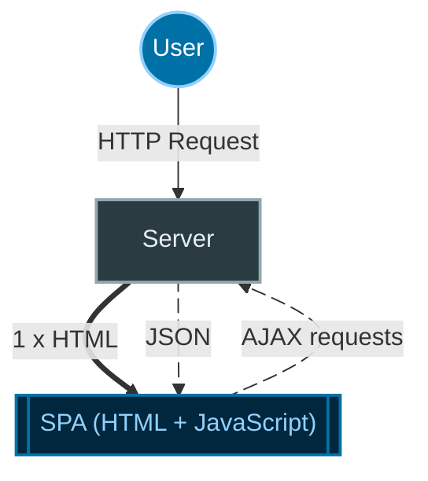
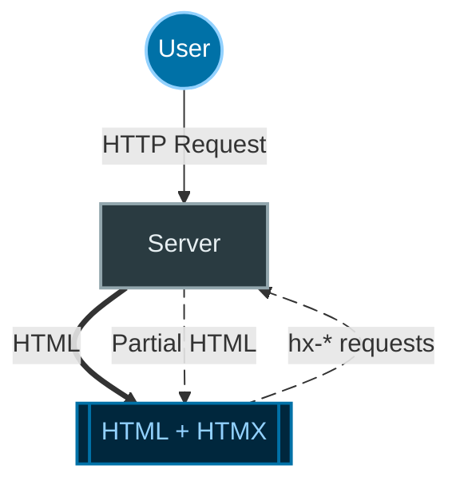
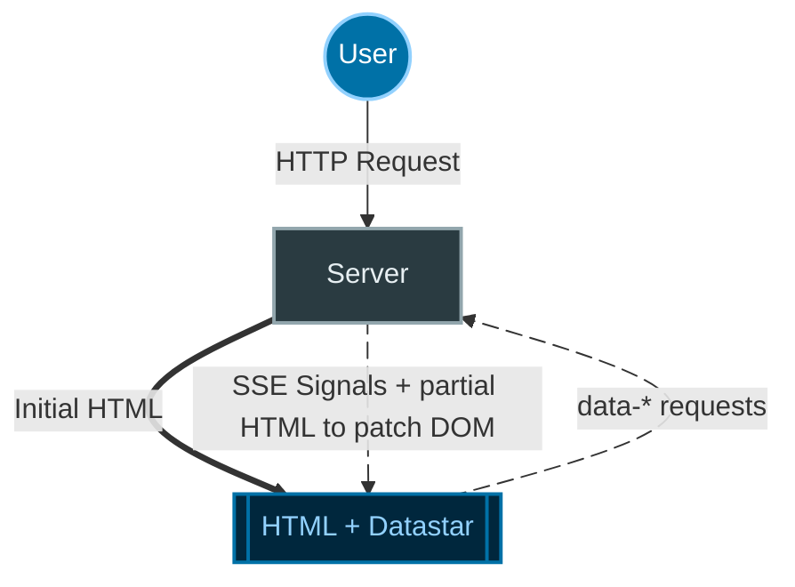

## Consider upgrading to a dynamic app

What are some ways you might upgrade the app to be more fluid?

- **Better UX** — show the recipe details inline, without a separate page load
- **Infinite scroll** — without "pages"
- **Dynamic Search** — server-side index with results as you type

## A Brief History of Web Architecture

### Web 1.0 (circa 1990)

In the original model for the World Wide Web, users send HTTP requests to a server and receive a **complete** HTML response. :




### Single Page Applications (2005+)

About 15 years later, AJAX ushered in asynchronous dynamic websites. Google Mail was one of the first examples. 

The server delivers an HTML and JavaScript bundle. From that point forward, AJAX requests are made to exchange **JSON** data with the server.




### Hypermedia Frameworks (2020+)

JavaScript is ubiquitous. Web front ends are amazing but also complex. Users want dynamic webapps. Developers struggle with the complexity. Sometimes, you just need dynamic HTML without the overhead of JavaScript frameworks.

**HTMX approach:**

With HTMX, you extend standard HTML with `hx-*` attributes, for example `hx-get:` to make a request to the server, or `hx-on` to trigger JavaScript actions. 

The key difference from the SPA model, shown in the diagram, is that **HTML fragments** are sent to the front end and automatically added into the DOM by HTMX.  

In HTMX, the front end drives most of the state changes. For ongoing updates from the server, HTMX uses WebSockets, with a client-side listener. For complex interactions, the HTMX team suggests pairing HTMX with the Alpine.js framework. 




**Datastar approach:**

Datastar follows a similar approach to HTMX, adding attributes with the `data-*` prefix. Attributes prefixed with `data-` are actually part of the HTML specification. 

The Datastar library, similar to HTMX, is a bit of JavaScript that can make requests to the server. 

Datastar includes data binding for front-end functionality similar to Alpine.js. Reactivity is through *signals* which can be thought of as reactive variables that automatically track and propagate changes in and to Datastar expressions. Signals are denoted using the $ prefix.

The big difference in philosphy seems to be the **Server** drives front end state changes. The front-end sends info to the back end, and the server sends update signals via Server Sent Events (SSE).  




## Hypermedia First Approach

Both HTMX and Datastar feature a *hypermedia first* approach:

- **HTMX**: Use additional HTML attributes to create requests from your app to the server
- **Datastar**: Modify your app state with events sent from the server

### HTMX Example

Selecting the following href invokes a GET action, and the server sends back HTML:

```html title="recipe link with HTMX"
<a href="#"
    hx-get="{{ url_for('endpoint', recipe_id=recipe.index) }}"
    hx-target="#recipe-details">Recipe 1</a>
```

### Datastar Example

Selecting the following href invokes a GET action, and the server sends an event back with data:

```html title="button with Datastar"
<button data-on:click="@get('/endpoint')">
    Open the pod bay doors, HAL.
</button>
<div id="hal"></div>
```

## Summary of Key Differences

- HTMX adds `hx-` prefixed attributes to existing HTML tags. 
- Datastar extends HTML through `data-` prefixed attributes using the HTML `data-*` standard (hence the name "data star").
- Both rely on JavaScript, but JavaScript is somewhat hidden from you, the developer.

We'll explore the similarities and differences in detail later, but for now, let's dive into HTMX!

